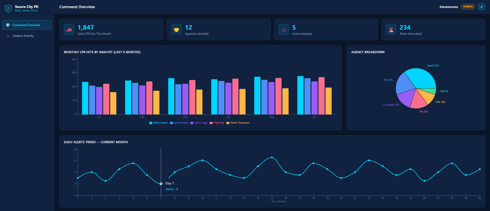
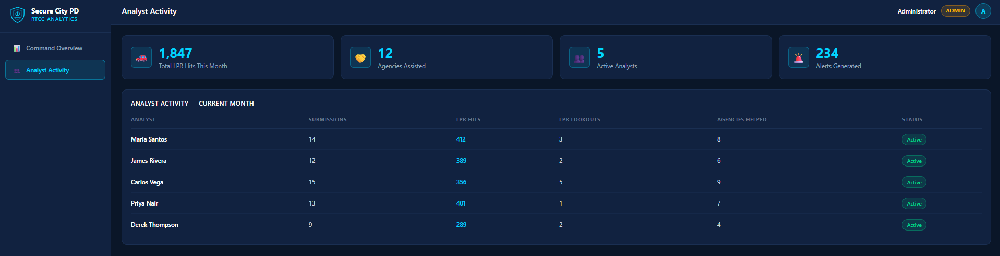
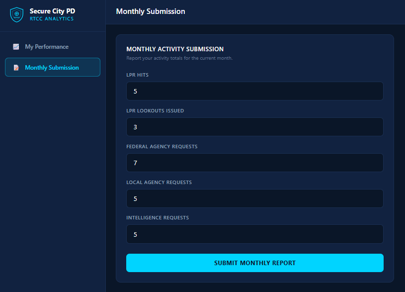

# Secure City RTCC Analytics Platform

[](https://github.com/ArmandoSNHU/Secure_City_PD_RTCC_Dashboard/actions/workflows/deploy.yml)
[](https://armandosnhu.github.io/Secure_City_PD_RTCC_Dashboard/)
[](#testing--code-quality)
[](https://react.dev)

A mock full-stack analytics dashboard for a **Real Time Crime Center (RTCC)**, built to demonstrate role-based authentication, data visualization, automated testing, CI/CD, and modern React architecture. All data is mocked — no real backend, no real law-enforcement data.

**Author:** Armando Gomez
**Live demo:** https://armandosnhu.github.io/Secure_City_PD_RTCC_Dashboard/

---

## Skills Demonstrated

| Skill area | What this project shows |
|---|---|
| **React 18 — hooks & state** | `useState` / `useEffect` across Login, Admin, and Analyst components; controlled forms; async data fetching with loading states |
| **Role-based access control** | Auth state drives rendering — an analyst physically cannot reach admin views; the API strips passwords before returning user objects |
| **API abstraction layer** | `mockApi.js` wraps all data behind async functions with simulated latency; swapping in a real backend is a one-file change |
| **Data visualization** | Recharts grouped bar, pie, and line charts — all fed from plain JS objects, no transformation layer needed |
| **Responsive UI / design system** | Tailwind CSS 4 with custom `@theme` tokens (`navy`, `accent`); stat cards collapse from 4 → 2 → 1 columns |
| **Automated testing** | 12 Vitest + React Testing Library tests covering credential rejection, password stripping, role routing, data scoping, and form submission |
| **CI/CD pipeline** | GitHub Actions quality gate (lint → tests) must pass before any build or deploy; PRs are gated but never deploy |
| **Accessibility** | Every form input has a paired `<label htmlFor>` — accessible to screen readers and directly queryable in tests |
| **Component architecture** | Shared `StatCard`, inline SVG `ShieldLogo`, view-array-driven form fields — DRY without premature abstraction |
| **Dev tooling** | ESLint flat config, Prettier, `npm ci` lockfile installs, separate `vitest.config.js` to avoid Tailwind/base-path leaking into tests |

---

## Screenshots

| Admin — Command Overview | Admin — Analyst Activity |
|---|---|
|  |  |

| Analyst — Monthly Submission | |
|---|---|
|  | *Login screen — dark command-center theme with grid backdrop and shield logo* |

---

## Table of Contents

1. [What This Project Is](#what-this-project-is)
2. [Tech Stack & Why Each Was Chosen](#tech-stack--why-each-was-chosen)
3. [Project Structure — What Every File Does](#project-structure--what-every-file-does)
4. [How Authentication & Role Routing Work](#how-authentication--role-routing-work)
5. [How Data Flows Through the App](#how-data-flows-through-the-app)
6. [The Two Dashboards](#the-two-dashboards)
7. [Design System](#design-system)
8. [Testing & Code Quality](#testing--code-quality)
9. [CI/CD Pipeline](#cicd-pipeline)
10. [Running the Project](#running-the-project)
11. [Test Credentials](#test-credentials)
12. [Swapping the Mock API for a Real Backend](#swapping-the-mock-api-for-a-real-backend)
13. [Development Progress](#development-progress)

---

## What This Project Is

Real Time Crime Centers support patrol officers and partner agencies with live intelligence — License Plate Reader (LPR) hits, lookouts, and inter-agency requests. This dashboard simulates the **reporting and analytics layer** of such a center:

- An **admin** sees center-wide metrics: total LPR hits, agencies assisted, alert trends, and a per-analyst activity table.
- An **analyst** sees only their own performance and submits a monthly activity report.

The goal was to build something that *behaves* like a production app (async API calls, loading states, auth gating, role-based views) while keeping the entire thing runnable with `npm run dev` and zero infrastructure.

---

## Tech Stack & Why Each Was Chosen

| Technology | What it does here | Why it was chosen |
|---|---|---|
| **React 18 (hooks only)** | All UI and state | Function components with `useState`/`useEffect` are the modern standard. No class components, no Redux — the state here (logged-in user, active view, fetched data, form values) is small enough that lifting it into `App.jsx` and passing props down is simpler and easier to reason about than adding a state library. |
| **Vite 5** | Dev server + build tool | Near-instant startup and hot module replacement. Chosen over Create React App (deprecated) and Webpack (slower, more config). Zero config needed beyond two plugins. |
| **Tailwind CSS 4** | All styling | Utility classes keep styles co-located with markup — no separate CSS files to keep in sync, no naming debates. v4's `@theme` block lets the project define custom design tokens (`navy`, `accent`) once and use them as native utilities (`bg-navy-light`, `text-accent`). Chosen over styled-components/CSS modules for speed of iteration on a dashboard with many small repeated UI patterns. |
| **Recharts 2** | Bar, pie, and line charts | Declarative, composable chart components that accept plain arrays of objects — the same shape the mock API returns, so no data transformation layer is needed. Chosen over Chart.js (imperative canvas API, awkward in React) and D3 (overkill for standard chart types). `ResponsiveContainer` gives fluid resizing for free. |
| **Mock REST API (plain JS module)** | Simulates a backend | `src/api/mockApi.js` wraps the mock data in `async` functions with artificial latency. This forces the UI to handle real-world conditions (loading states, awaited calls) and means swapping in a real backend later only requires changing one file — components never import data directly. |
| **No router library** | View switching | React Router was deliberately skipped. There are only four views gated by two roles; a single `activeView` string in state with conditional rendering does the job with zero dependencies. If the app grew real URLs/deep-linking requirements, React Router would be the upgrade path. |

---

## Project Structure — What Every File Does

```
Secure_City_PD_RTCC_Dashboard/
├── index.html                  # HTML shell; mounts React at #root
├── package.json                # Dependencies and npm scripts
├── vite.config.js              # Vite config: React + Tailwind plugins, Pages base path
├── vitest.config.js            # Test runner config (jsdom, globals, setup file)
├── eslint.config.js            # ESLint flat config (correctness rules only)
├── .prettierrc.json            # Prettier formatting rules
├── CHANGELOG.md                # Development progress by phase
├── .gitignore                  # Excludes node_modules, dist, local files
├── .github/workflows/
│   └── deploy.yml              # CI/CD: quality gate -> build -> Pages deploy
├── docs/screenshots/           # README screenshot images
└── src/
    ├── main.jsx                # Entry point; renders <App/> into the DOM
    ├── index.css               # Tailwind import + @theme design tokens + body defaults
    ├── App.jsx                 # Root component: auth state + role-based routing
    ├── App.test.jsx            # Integration tests: login -> routing -> logout
    ├── test/
    │   └── setup.js            # Registers jest-dom matchers before each test file
    ├── api/
    │   └── mockApi.js          # Fake REST layer (login, stats, charts, submissions)
    ├── data/
    │   └── mockData.js         # All mock records: users, stats, chart datasets
    └── components/
        ├── Login.jsx           # Dark-themed login screen with credential validation
        ├── Login.test.jsx      # Credential validation + password-stripping tests
        ├── Sidebar.jsx         # Role-aware navigation + logout
        ├── TopNav.jsx          # Sticky header: view title, user name, role badge
        ├── AdminDashboard.jsx  # Center-wide stats, 3 charts, analyst table
        ├── AnalystDashboard.jsx# Personal stats + monthly submission form
        ├── AnalystDashboard.test.jsx # Submission form behavior tests
        ├── StatCard.jsx        # Reusable KPI card (icon, value, label)
        └── ShieldLogo.jsx      # Inline SVG police shield, used on login + sidebar
```

### File-by-file detail

**`index.html`** — The only HTML file. Vite injects the bundled JS via the `<script type="module">` tag. Page title set for browser tab.

**`vite.config.js`** — Registers two plugins: `@vitejs/plugin-react` (JSX transform + fast refresh) and `@tailwindcss/vite` (Tailwind v4's first-party Vite integration, replacing the old PostCSS setup).

**`src/main.jsx`** — Standard React 18 bootstrap: `ReactDOM.createRoot(...).render(<App/>)` wrapped in `StrictMode` to surface unsafe patterns during development.

**`src/index.css`** — Three jobs:
1. `@import "tailwindcss"` pulls in the framework.
2. The `@theme` block defines the design tokens (`--color-navy`, `--color-navy-light`, `--color-navy-lighter`, `--color-accent`) which Tailwind v4 turns into usable utility classes.
3. Sets the global background, text color, and font on `body`.

**`src/data/mockData.js`** — Single source of truth for every piece of data in the app:
- `users` — 6 accounts (1 admin, 5 analysts) with credentials and roles.
- `overviewStats` — the four admin KPI numbers (1,847 LPR hits, 12 agencies, 5 analysts, 234 alerts).
- `analystStats` — per-analyst monthly numbers (LPR hits, agencies, lookouts, submissions, status). Used by both the admin table and each analyst's personal view.
- `monthlyLprByAnalyst` — 6 months of LPR hits per analyst, shaped for Recharts' grouped bar chart (one object per month, one key per analyst).
- `agencyBreakdown` — pie chart data: Sheriff 35%, DPS 20%, Constable 15%, FBI 15%, DEA 10%, CBP 5%.
- `dailyAlerts` — 30 days of alert counts for the line chart.
- `CHART_COLORS` — shared palette so the bar chart and pie chart stay visually consistent.

**`src/api/mockApi.js`** — Simulates a REST backend. Every function is `async` and awaits a `delay()` (300–500 ms) to mimic network latency. Key design decisions:
- `login()` validates credentials case-insensitively on username, throws on failure (so the UI exercises real error handling), and **strips the password from the returned user object** — mirroring what a real API should do.
- `submitMonthlyReport()` returns a confirmation object with a server-style ISO timestamp.
- Components only ever talk to this module. Replacing `delay()` + in-memory lookups with `fetch()` calls converts the whole app to a real backend without touching any component.

**`src/App.jsx`** — The root component and the app's "router":
- Holds the two top-level pieces of state: `user` (null = logged out) and `activeView`.
- `handleLogin` stores the authenticated user and selects the correct landing view by role (`overview` for admin, `mystats` for analyst).
- Renders `<Login/>` when logged out; otherwise the sidebar + top nav + the dashboard matching the user's role. An analyst can never render `AdminDashboard` because the branch is on `user.role`, which comes from the (mock) server — not from anything client-editable like a URL.

**`src/components/Login.jsx`** — Controlled form (`username`, `password` in state). On submit it calls `api.login()`, shows a loading state on the button ("Authenticating..."), and renders the API's error message in a red alert box on bad credentials. The grid-line background overlay is pure CSS (two layered `linear-gradient`s) — no image assets.

**`src/components/Sidebar.jsx`** — Receives the user and renders a different nav list per role (admin: Command Overview / Analyst Activity; analyst: My Performance / Monthly Submission). The active item is highlighted with the accent color. Logout button at the bottom simply clears the user state in `App`.

**`src/components/TopNav.jsx`** — Sticky header showing the current view title, the logged-in user's name, a color-coded role badge (amber = admin, blue = analyst), and an initials avatar derived from the user's name.

**`src/components/AdminDashboard.jsx`** — Fetches all five datasets in parallel in one `useEffect`, holding each in its own state slice. Renders:
- Four `StatCard`s (always visible).
- **Overview view:** grouped bar chart (monthly LPR hits, one bar series per analyst), pie chart (agency breakdown with percentage labels), and line chart (daily alerts). All charts use a shared dark tooltip style and the shared color palette.
- **Analyst Activity view:** a table of every analyst with submissions, LPR hits, LPR lookouts, agencies helped, and an Active/Inactive status pill.

**`src/components/AnalystDashboard.jsx`** — Fetches only the logged-in analyst's record (`api.getAnalystById(user.id)`), so an analyst never receives other analysts' data. Renders:
- **My Performance view:** four personal KPI cards + a plain-language summary.
- **Monthly Submission view:** a controlled form with five numeric fields (LPR Hits, LPR Lookouts Issued, Federal Agency Requests, Local Agency Requests, Intelligence Requests). The fields are driven by a `formFields` array so adding a field is a one-line change. On submit: button shows "Submitting...", the mock API responds, a green confirmation banner appears with the server timestamp, and the form resets.

**`src/components/StatCard.jsx`** — Tiny reusable presentational component (icon, big accent-colored value, muted label). Exists because the same KPI-card pattern appears 8 times across both dashboards.

**`src/components/ShieldLogo.jsx`** — Hand-drawn inline SVG (shield outline, inner shield, crosshair motif). Inline SVG instead of an image file means it scales crisply at any size, takes a `size` prop, and ships zero extra network requests.

---

## How Authentication & Role Routing Work

```
Login form ──▶ api.login(username, password)
                   │
        ┌──────────┴───────────┐
        ▼                      ▼
   match found             no match
        │                      │
  password stripped      Error thrown ──▶ red alert in form
        │
        ▼
  App.setUser(user) ──▶ user.role === 'admin' ? AdminDashboard : AnalystDashboard
```

- Auth state lives in `App.jsx` as a single `user` object. `null` means logged out — there is no way to reach a dashboard without passing through `api.login()`.
- Routing is **role-derived, not URL-derived**: the rendered dashboard branches directly on `user.role`. An analyst physically cannot render the admin component.
- Logout sets `user` back to `null`, which unmounts everything behind the login wall.

> ⚠️ This is a *mock*. Credentials live in client-side code and there are no tokens/sessions. In production: server-side auth, hashed passwords, JWT or session cookies, and role checks enforced on the API — never only in the UI.

---

## How Data Flows Through the App

```
mockData.js  ──imported by──▶  mockApi.js  ──awaited by──▶  components (useEffect)
 (raw records)                (async + latency)              (useState slices)
```

1. Components never import `mockData.js` directly (except the shared `CHART_COLORS` constant). All data access goes through the API layer.
2. Each dashboard fetches in `useEffect` on mount and stores results in local state.
3. Loading states render until data arrives (real, because the API has artificial latency).
4. The submission form goes the other direction: form state → `api.submitMonthlyReport()` → confirmation object → success banner.

This one-directional flow (data down via props, events up via callbacks) is plain idiomatic React — no context, no global store, because nothing here is shared deeply enough to warrant them.

---

## The Two Dashboards

| | Admin | Analyst |
|---|---|---|
| Landing view | Command Overview | My Performance |
| KPI cards | Center-wide (1,847 LPR hits, 12 agencies, 5 analysts, 234 alerts) | Personal only (own LPR hits, agency assists, lookouts, submissions) |
| Charts | Bar (6-month LPR by analyst), Pie (agency breakdown), Line (daily alerts) | — |
| Table | All-analyst activity with status pills | — |
| Form | — | Monthly activity submission with confirmation |
| Data scope | Everything | Only their own record, fetched by their user id |

---

## Design System

| Token | Value | Used for |
|---|---|---|
| `navy` | `#0a1628` | Page background |
| `navy-light` | `#112240` | Cards, sidebar, top nav |
| `navy-lighter` | `#1a2f52` | Borders, chart gridlines, hover states |
| `accent` | `#00d4ff` | Electric blue — logo, KPI values, active nav, buttons, primary chart series |

Supporting colors: amber for the admin badge, emerald for Active/success states, red for errors/logout. The dark navy + electric blue palette was chosen for a professional law-enforcement / command-center aesthetic, and the high contrast keeps charts readable on dark backgrounds.

Layout: fixed 16rem sidebar + fluid main column; stat-card grids collapse from 4 → 2 → 1 columns on smaller screens; charts resize via `ResponsiveContainer`.

---

## Testing & Code Quality

### Unit & integration tests — Vitest + React Testing Library

**Why Vitest:** it shares Vite's transform pipeline, so tests run against the exact same JSX/ESM setup as the app with zero extra Babel/Jest config. React Testing Library was chosen because it tests *behavior through the DOM the way a user experiences it* (type into fields, click buttons, read what renders) rather than implementation details.

12 tests across 3 suites:

| Suite | What it proves |
|---|---|
| `src/components/Login.test.jsx` | Bad credentials show the API error and never log in; valid credentials return a user object **with the password stripped**; username matching is case-insensitive |
| `src/App.test.jsx` | Logged-out users only see the login screen; admin lands on Command Overview with center-wide stats; an analyst lands on My Performance and **cannot see admin views or other analysts' data**; logout fully returns to the login wall |
| `src/components/AnalystDashboard.test.jsx` | The submission form renders all five fields, submits to the API, shows the confirmation banner, and resets afterward |

Recharts is mocked in the App suite because jsdom has no layout engine — chart internals aren't what those tests assert; routing and data scoping are.

```bash
npm test            # run the suite once (what CI runs)
npm run test:watch  # watch mode during development
npm run test:coverage
```

### Linting & formatting — ESLint + Prettier

- **ESLint** (flat config, `eslint.config.js`) enforces correctness: recommended JS rules, `react-hooks/rules-of-hooks` + `exhaustive-deps`, and react-refresh safety. `eslint-config-prettier` is layered last so ESLint never fights the formatter.
- **Prettier** (`.prettierrc.json`) owns all formatting decisions.

```bash
npm run lint          # what CI runs
npm run format        # rewrite files in place
npm run format:check
```

---

## CI/CD Pipeline

Every push to `main` (and every pull request) runs the GitHub Actions pipeline in `.github/workflows/deploy.yml`:

```
push/PR ──▶ quality (lint + 12 tests) ──▶ build (vite build) ──▶ deploy (GitHub Pages)
                  │ fails?                                            │
                  ▼                                                   ▼
            nothing deploys                            https://armandosnhu.github.io/...
```

Design decisions:
- **Quality gate first** — `build` declares `needs: quality`, so broken code can never reach production.
- **PRs run the gate but never deploy** — the deploy job is skipped for `pull_request` events.
- **Concurrency control** — a newer push cancels an in-flight deploy of stale code.
- **`npm ci`** (not `npm install`) for reproducible installs from the lockfile.

---

## Running the Project

```bash
npm install
npm run dev      # http://localhost:5173
npm test         # run the test suite
npm run lint     # lint check
npm run build    # production build to dist/
npm run preview  # serve the production build locally
```

Requires Node 18+.

---

## Test Credentials

| Role | Username | Password |
|---|---|---|
| Admin | `admin` | `SecureCity2026` |
| Analyst | `Maria Santos` | `analyst01` |
| Analyst | `James Rivera` | `analyst02` |
| Analyst | `Carlos Vega` | `analyst03` |
| Analyst | `Priya Nair` | `analyst04` |
| Analyst | `Derek Thompson` | `analyst05` |

---

## Swapping the Mock API for a Real Backend

Because every component talks only to `src/api/mockApi.js`, converting this to a real full-stack app means rewriting that single file, e.g.:

```js
async login(username, password) {
  const res = await fetch('/api/auth/login', {
    method: 'POST',
    headers: { 'Content-Type': 'application/json' },
    body: JSON.stringify({ username, password }),
  })
  if (!res.ok) throw new Error('Invalid credentials. Access denied.')
  return res.json()
}
```

A natural backend pairing would be Java + Spring Boot (REST controllers matching each `api.*` function, Spring Security for auth, PostgreSQL for analyst records) — the mock API's function signatures were designed to map one-to-one onto REST endpoints.

---

## Development Progress

The project was built in deliberate phases — see **[CHANGELOG.md](CHANGELOG.md)** for the full history:

| Phase | Delivered |
|---|---|
| 1.0.0 | Core dashboard: auth, role routing, charts, submission form, mock API |
| 1.1.0 | Documentation: README + header docblocks and inline comments in every source file |
| 1.2.0 | Deployment: Vite base path + GitHub Actions deploy to GitHub Pages |
| 1.3.0 | Quality engineering: 12 Vitest/RTL tests, ESLint + Prettier, CI quality gate, accessibility (label/input pairing), badges & screenshots |
